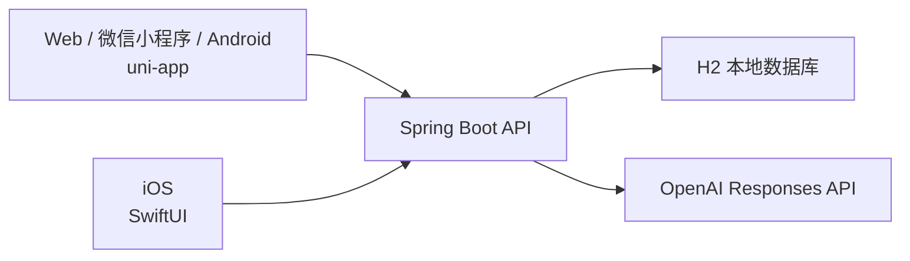

# 架构总览

## 1. 项目目标

这个项目要解决的是程序员在求职准备里的几个高频痛点：

- 不同岗位需要刷不同题，题目很难系统整理
- 面试经验分散在笔记、收藏夹、聊天记录里
- 很多人知道“要准备”，但不知道“应该怎么从架构上搭一个长期可维护的题库系统”

## 2. 为什么采用现在这套架构

你是 iOS 工程师，并且明确要求 iOS 使用 `SwiftUI`。所以我没有强行做“四端一套 UI”，而是做了更适合你继续维护的拆分：

这样做的好处：

- 后端规则、Prompt、数据表只有一套
- iOS 端可以完全按你熟悉的 `SwiftUI + async/await` 写
- Web / 微信 / Android 不需要各写一套页面

## 3. 模块职责

### `backend/`

- 保存岗位画像
- 根据岗位和补充要求生成题集
- 调用 OpenAI API
- 将题集和题目持久化到本地 H2 文件数据库
- 对外暴露 REST API

### `frontend/`

- 给 Web / 微信小程序 / Android 复用
- 展示岗位模板
- 提交生成请求
- 查看历史题集与详情

### `ios-swiftui/`

- 提供原生 iOS UI
- 通过统一 API 与后端通信
- 适合作为你继续扩展的主客户端

## 4. 数据流

1. 用户选择岗位，如 `iOS中级`
2. 前端把岗位、难度、知识点、自定义要求提交给后端
3. 后端组装 Prompt
4. 后端调用 OpenAI Responses API 生成结构化 JSON
5. 后端把题集与题目写入 H2 本地数据库
6. 前端读取详情并展示题目与答题思路

## 5. 为什么后端默认带 Mock 生成

这是为了降低你第一次启动项目的门槛。

- 如果没有 `OPENAI_API_KEY`，项目依然可以跑通
- 你可以先把前后端接口、页面、数据库结构走通
- 等你准备好真实 Key，再把生成器切换成 OpenAI

## 6. 当前技术选型

- 后端：`Spring Boot 3.5.6 + Spring Data JPA + H2`
- OpenAI：`Responses API`
- 多端前端：`uni-app + Vue 3`
- iOS：`SwiftUI`

## 7. 下一步建议

先从 [02-后端从零搭建.md](/Users/geraldgan/Documents/GeraldGan/实践/InterviewSystem/docs/02-后端从零搭建.md) 看起，因为所有客户端都依赖后端接口。
