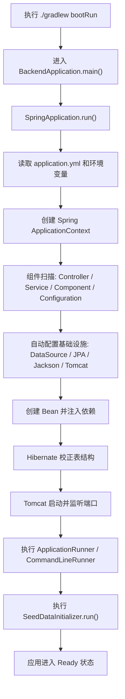
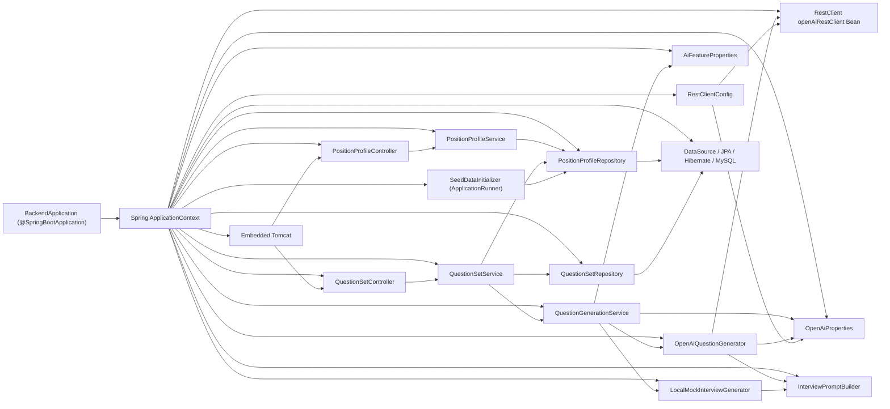

# Spring Boot 启动流程与 Bean 依赖图

这份文档专门讲这几个问题：

- 这个后端项目运行起来时，内部到底发生了什么
- `Spring Boot` 在这个项目里扮演什么角色
- `SeedDataInitializer` 会不会执行，什么时候执行
- 各个 `Bean` 是怎么被 Spring 串起来的
- 你平时应该怎么运行这个后端项目

如果你是从 `iOS + SwiftUI` 视角来看，可以先把它理解成：

- `Spring Boot` 像整个后端 App 的启动器和运行框架
- `Bean` 像被框架托管的对象
- Spring 会负责创建对象、注入依赖、管理生命周期
- 你只需要写“这些对象想要什么依赖”，不需要自己手动 `new` 整套系统

---

## 1. 先回答最直接的问题

### 后端项目运行起来的入口在哪里

入口在：

- [BackendApplication.java](/Users/geraldgan/Documents/GeraldGan/实践/InterviewSystem/backend/src/main/java/com/interview/backend/BackendApplication.java)

核心代码：

```java
@SpringBootApplication
public class BackendApplication {

    public static void main(String[] args) {
        SpringApplication.run(BackendApplication.class, args);
    }
}
```

也就是说，后端启动的起点就是：

```text
main()
-> SpringApplication.run(...)
```

### 会走 `SeedDataInitializer` 吗

会走。

文件在：

- [SeedDataInitializer.java](/Users/geraldgan/Documents/GeraldGan/实践/InterviewSystem/backend/src/main/java/com/interview/backend/service/SeedDataInitializer.java)

它之所以会自动执行，是因为：

1. 它有 `@Component`
2. 它实现了 `ApplicationRunner`

Spring Boot 在启动收尾阶段会自动调用所有 `ApplicationRunner` 的 `run(...)` 方法，所以它会被执行。

但是要注意：

- “会执行”不等于“每次都插数据”

它内部先判断：

```java
if (positionProfileRepository.count() > 0) {
    return;
}
```

所以：

- 如果数据库里已经有岗位数据，它会执行，但立刻返回
- 如果数据库里没有数据，它才会 `saveAll(...)` 插入默认岗位

---

## 2. Spring Boot 在这个项目里的作用是什么

这部分非常关键。

你可以把 `Spring Boot` 理解成：

```text
后端应用的启动器 + 运行时框架 + 自动装配器
```

它在这个项目里主要做了 6 件事。

### 1. 启动整个应用

当你执行：

```bash
./gradlew bootRun
```

最终会跑到：

```java
SpringApplication.run(BackendApplication.class, args);
```

然后 Spring Boot 开始把整个 Java 后端应用搭起来。

### 2. 创建 Spring 容器

Spring Boot 会创建一个 `ApplicationContext`，你可以把它理解成：

- 一个专门存放和管理对象的容器

这个容器里会保存：

- Controller
- Service
- Repository
- 配置类
- 配置属性类
- 一些框架自动创建的 Bean

这些被容器管理的对象，就叫 `Bean`。

### 3. 自动扫描项目里的组件

`@SpringBootApplication` 包含组件扫描能力。

你的启动类在：

- `com.interview.backend`

所以它会自动扫描这个包及其子包里的：

- `@RestController`
- `@Service`
- `@Component`
- `@Configuration`

例如这些类都会被扫描到：

- [PositionProfileController.java](/Users/geraldgan/Documents/GeraldGan/实践/InterviewSystem/backend/src/main/java/com/interview/backend/controller/PositionProfileController.java)
- [QuestionSetController.java](/Users/geraldgan/Documents/GeraldGan/实践/InterviewSystem/backend/src/main/java/com/interview/backend/controller/QuestionSetController.java)
- [PositionProfileService.java](/Users/geraldgan/Documents/GeraldGan/实践/InterviewSystem/backend/src/main/java/com/interview/backend/service/PositionProfileService.java)
- [QuestionSetService.java](/Users/geraldgan/Documents/GeraldGan/实践/InterviewSystem/backend/src/main/java/com/interview/backend/service/QuestionSetService.java)
- [SeedDataInitializer.java](/Users/geraldgan/Documents/GeraldGan/实践/InterviewSystem/backend/src/main/java/com/interview/backend/service/SeedDataInitializer.java)

### 4. 自动配置基础设施

Spring Boot 会根据依赖和配置文件自动帮你配置很多东西，比如：

- MySQL 数据源 `DataSource`
- JPA / Hibernate
- 事务管理器
- Jackson JSON 序列化
- 内嵌 Tomcat
- Spring MVC

这些配置的来源之一就是：

- [application.yml](/Users/geraldgan/Documents/GeraldGan/实践/InterviewSystem/backend/src/main/resources/application.yml)

比如你这里配置了：

- `spring.datasource.*`
- `spring.jpa.*`
- `server.port`
- `app.openai.*`
- `app.ai.*`

Spring Boot 会读取这些配置，并用它们来初始化系统。

### 5. 负责依赖注入

例如：

- `QuestionSetController` 依赖 `QuestionSetService`
- `QuestionSetService` 依赖 `QuestionSetRepository`
- `QuestionGenerationService` 依赖 `OpenAiQuestionGenerator`

这些对象之间不是你手动 `new` 的，而是 Spring 自动创建并注入的。

这就是所谓的：

- IoC
- DI

也就是控制反转和依赖注入。

### 6. 管理启动生命周期

Spring Boot 不只是“把对象创建出来”，还会管理启动过程中的生命周期节点。

例如：

- 初始化 Bean
- 启动 Web 服务器
- 执行 `ApplicationRunner`
- 最后进入 ready 状态

`SeedDataInitializer` 正是借助这个生命周期钩子自动执行的。

---

## 3. 这个项目启动时的整体流程图

下面这张图是“从运行命令到项目 ready”的整体流程。



这张图里最值得记住的是：

```text
先把框架和 Bean 都准备好
再执行 SeedDataInitializer
最后应用 ready
```

---

## 4. 启动时的 Bean 依赖关系图

下面这张图专门讲“项目里的对象是怎么互相依赖的”。



你可以按这个方式理解：

- `Controller` 依赖 `Service`
- `Service` 依赖 `Repository`
- `Repository` 最终依赖 JPA 和 MySQL
- `QuestionGenerationService` 依赖 OpenAI 生成器、Mock 生成器和配置
- `SeedDataInitializer` 依赖 `PositionProfileRepository`

---

## 5. `SeedDataInitializer` 是怎么串联起来的

先看它的类定义：

```java
@Component
public class SeedDataInitializer implements ApplicationRunner
```

这里有两个关键点。

### `@Component`

表示：

- 它是一个 Spring Bean
- Spring 启动时会创建它

### `implements ApplicationRunner`

表示：

- 它是一个“启动后执行器”
- Spring Boot 在启动流程接近完成时会自动调用它的 `run(...)`

所以它不是：

- 某个 Controller 手动调用
- 某个 Service 手动调用
- 你在 `main()` 里显式调用

而是：

- Spring Boot 启动生命周期自动调用

也就是说，它和业务接口没有直接调用关系，它属于“启动期逻辑”。

---

## 6. `SeedDataInitializer` 执行时到底做什么

它的核心逻辑是：

```java
if (positionProfileRepository.count() > 0) {
    return;
}

positionProfileRepository.saveAll(List.of(...));
```

翻译成人话就是：

1. 先去数据库数一下 `position_profiles` 表里有没有数据
2. 如果已经有数据，就不重复插入
3. 如果没有数据，就插入默认岗位

默认会插入这些岗位：

- `ios-mid`
- `java-backend`
- `ai-agent-engineer`
- `frontend-mid`

所以它的角色是：

```text
第一次启动时帮你准备演示数据
后续启动时避免重复插入
```

---

## 7. 为什么它能直接调用数据库

因为它依赖了：

- [PositionProfileRepository.java](/Users/geraldgan/Documents/GeraldGan/实践/InterviewSystem/backend/src/main/java/com/interview/backend/repository/PositionProfileRepository.java)

构造函数里写的是：

```java
private final PositionProfileRepository positionProfileRepository;

public SeedDataInitializer(PositionProfileRepository positionProfileRepository) {
    this.positionProfileRepository = positionProfileRepository;
}
```

Spring 在创建 `SeedDataInitializer` 的时候，会自动把 `PositionProfileRepository` 注入进去。

而 `PositionProfileRepository` 又是 Spring Data JPA 自动创建的 Repository Bean。

所以这条链是：

```text
Spring Boot
-> 创建 SeedDataInitializer
-> 注入 PositionProfileRepository
-> run() 执行
-> Repository 调数据库
```

---

## 8. 这个项目当前运行时，`SeedDataInitializer` 会发生什么

你当前的数据库里：

- `position_profiles` 已经有 4 条数据

所以这次启动时的行为是：

1. `SeedDataInitializer.run()` 会执行
2. `positionProfileRepository.count()` 返回大于 0
3. 直接 `return`
4. 不会重复 `saveAll(...)`

所以准确说法是：

- 它“会走”
- 但“这次不会真的插数据”

---

## 9. `@SpringBootApplication` 在这里到底做了什么

虽然你代码里只写了一句：

```java
@SpringBootApplication
```

但它实际上帮你做了三大类事情。

### 1. 开启组件扫描

它会扫描当前包及子包里的：

- `@Controller`
- `@RestController`
- `@Service`
- `@Component`
- `@Configuration`

### 2. 开启自动配置

因为你的项目依赖了：

- `spring-boot-starter-web`
- `spring-boot-starter-data-jpa`
- MySQL 驱动

Spring Boot 会自动判断：

- 这是个 Web 应用
- 需要内嵌 Tomcat
- 需要数据源
- 需要 Hibernate
- 需要 MVC

然后自动把常见 Bean 配出来。

### 3. 作为配置入口

Spring Boot 会以这个启动类为根，建立整个应用的上下文。

所以你可以把它理解成：

```text
整个后端应用的总开关
```

---

## 10. Spring Boot 是怎么“运行这个项目”的

从你平时的使用角度，可以分成两个层面理解。

### 第一层：命令层面

你执行：

```bash
cd /Users/geraldgan/Documents/GeraldGan/实践/InterviewSystem/backend
./gradlew bootRun
```

Gradle 会：

1. 编译代码
2. 处理资源文件
3. 启动 Spring Boot 应用

### 第二层：Spring Boot 层面

Spring Boot 启动后会：

1. 读取配置
2. 建 Spring 容器
3. 扫描 Bean
4. 自动配置数据源、JPA、Tomcat
5. 注入依赖
6. 启动 Web 服务
7. 执行 `ApplicationRunner`
8. 应用 ready

也就是说：

```text
Gradle 负责把程序跑起来
Spring Boot 负责把后端系统搭起来
```

---

## 11. 这个项目里 Spring Boot 读了哪些配置

最主要的配置文件是：

- [application.yml](/Users/geraldgan/Documents/GeraldGan/实践/InterviewSystem/backend/src/main/resources/application.yml)

这里面几类配置最重要：

### 数据库配置

```yaml
spring:
  datasource:
    url: ...
    username: ...
    password: ...
```

Spring Boot 读到这些后，会自动配置：

- `DataSource`
- JPA
- Hibernate

### JPA 配置

```yaml
spring:
  jpa:
    hibernate:
      ddl-auto: update
```

意思是：

- 启动时让 Hibernate 根据实体尽量更新表结构

### Web 端口

```yaml
server:
  port: 8080
```

你运行时如果传了：

```bash
SERVER_PORT=8081
```

就会覆盖掉默认 `8080`。

### 自定义配置

```yaml
app:
  ai:
    mock-enabled: true
  openai:
    ...
```

这些会绑定到：

- [AiFeatureProperties.java](/Users/geraldgan/Documents/GeraldGan/实践/InterviewSystem/backend/src/main/java/com/interview/backend/config/AiFeatureProperties.java)
- [OpenAiProperties.java](/Users/geraldgan/Documents/GeraldGan/实践/InterviewSystem/backend/src/main/java/com/interview/backend/config/OpenAiProperties.java)

所以配置文件不仅给框架用，也给你自己的业务 Bean 用。

---

## 12. 这个项目现在应该怎么运行

如果你要手动跑这个后端，推荐按这个顺序。

### 1. 先确保 MySQL 已启动

```bash
brew services start mysql
```

### 2. 确保数据库存在

```bash
mysql -u root -e "CREATE DATABASE IF NOT EXISTS interview_system DEFAULT CHARACTER SET utf8mb4 COLLATE utf8mb4_unicode_ci;"
```

### 3. 进入后端目录

```bash
cd /Users/geraldgan/Documents/GeraldGan/实践/InterviewSystem/backend
```

### 4. 配置环境变量并启动

```bash
export SPRING_DATASOURCE_URL="jdbc:mysql://127.0.0.1:3306/interview_system?createDatabaseIfNotExist=true&useSSL=false&allowPublicKeyRetrieval=true&serverTimezone=Asia/Shanghai&characterEncoding=UTF-8"
export SPRING_DATASOURCE_USERNAME="root"
export SPRING_DATASOURCE_PASSWORD=""
export OPENAI_API_KEY="你的 OpenAI Key"
SERVER_PORT=8081 JAVA_TOOL_OPTIONS='-Djavax.net.ssl.trustStoreType=KeychainStore -Djavax.net.ssl.trustStore=NONE' ./gradlew bootRun
```

如果你暂时没有 `OPENAI_API_KEY`，也能启动。

因为当前项目里：

- `app.ai.mock-enabled: true`

所以它会自动回退到本地 Mock 生成器。

---

## 13. 启动成功后怎么验证

最直接的方式是打健康检查：

```bash
curl -s http://127.0.0.1:8081/api/health
```

如果返回类似：

```json
{"status":"ok2"}
```

说明：

- Spring Boot 已经启动成功
- Tomcat 在监听
- 路由已经注册成功

这通常也意味着：

- Bean 基本都初始化成功了
- `SeedDataInitializer` 也已经执行完毕

---

## 14. 一句话总结 Spring Boot 在这个项目里的角色

你可以先记这一句：

```text
Spring Boot 负责把“配置、Bean、数据库、Web 服务、启动生命周期”全都组装起来，
让你只专注写业务类，而不用手动拼整个后端应用。
```

如果再压缩一点，就是：

```text
Gradle 把程序跑起来，Spring Boot 把系统搭起来。
```

---

## 15. 最后用最短的话再记一遍

这个项目的启动过程可以记成：

```text
main()
-> Spring Boot 读配置
-> 创建容器
-> 扫描 Bean
-> 配置数据库 / JPA / Tomcat
-> 注入依赖
-> 启动 Web 服务
-> 执行 SeedDataInitializer
-> 应用 ready
```

而 `SeedDataInitializer` 的作用是：

```text
启动时检查岗位表有没有数据，
没有就插默认岗位，
有就直接跳过。
```
